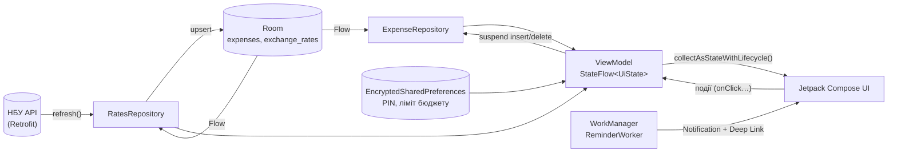

# 💰 FinTreker — особистий трекер витрат

[](https://github.com/omykhantso/fintreker/actions/workflows/android.yml)


**FinTreker** — Android-додаток для обліку особистих витрат, написаний на Kotlin + Jetpack Compose.
Це наскрізний навчальний проєкт із курсу «Програмування мобільних додатків» (тема №3 «Трекер витрат»),
що охоплює 6 лабораторних робіт: від базового UI до фонових сповіщень і Unit-тестів.

## Можливості

| | |
|---|---|
| ➕ **Облік витрат** | Сума з валідацією (> 0, кома або крапка), 6 категорій, нотатка. |
| 📊 **Баланс місяця** | Залишок місячного бюджету, прогрес-бар, попередження при використанні ≥ 80% і при перевищенні ліміту. |
| 💱 **Курси НБУ** | Залишок у USD/EUR за курсом Національного банку. Працює **офлайн** — курс береться з кешу Room. |
| 🥧 **Аналітика** | Кругова діаграма розподілу витрат за категоріями за поточний місяць; клік по категорії відкриває відфільтровану історію. |
| 📜 **Історія** | Список з фільтром за категорією та **нескінченною прокруткою** (пагінація). |
| 🔐 **Безпека** | PIN-код (SHA-256 + сіль) і ліміт бюджету зберігаються в `EncryptedSharedPreferences` (AES-256-GCM, Android Keystore). |
| 🔔 **Нагадування** | Щодня о 20:00 (WorkManager): «Не забудьте зафіксувати сьогоднішні витрати!». Клік відкриває екран нової витрати (Deep Link). Розклад відновлюється після перезавантаження телефону. |

## Архітектура

Додаток побудований за патерном **MVVM** з односпрямованим потоком даних (UDF) та принципом
**Offline-First / Single Source of Truth**: інтерфейс ніколи не читає дані з мережі напряму — лише з бази Room.



```
┌──────────── UI (Compose) ────────────┐
│  Screens · Components · Theme · Nav   │   collectAsStateWithLifecycle()
└───────────────▲──────────────────────┘
                │ UiState (sealed)          ▲ події користувача
┌───────────────┴──────────────────────┐   │
│  ViewModel  (StateFlow, viewModelScope)│───┘
└───────────────▲──────────────────────┘
                │ Flow / suspend
┌───────────────┴──────────────────────┐        ┌────────────────────────┐
│  Repository (Offline-First)          │◄───────│  domain: чисті функції  │
│  ┌────────────┐   ┌───────────────┐  │        │  баланс · конвертація   │
│  │ Room (SSOT)│◄──│ Retrofit (НБУ)│  │        │  валідація · розклад    │
│  └────────────┘   └───────────────┘  │        └────────────────────────┘
└──────────────────────────────────────┘
```

### Обробка помилок мережі

`RatesRepository.refresh()` не кидає винятків, а повертає `SyncResult` (`Success` / `Failure`).
`RatesViewModel` поєднує кеш Room зі статусом оновлення в `sealed interface RatesUiState`:

| Кеш Room | Мережа | Стан UI |
|---|---|---|
| порожній | очікування | `Loading` (shimmer) |
| є | ок | `Success` |
| є | **немає інтернету** | `Success(isOffline = true)` — курс «станом на дату», додаток працює |
| порожній | **немає інтернету** | `Error(message)` + кнопка «Спробувати знову» |

## Технології

| Шар | Бібліотека |
|---|---|
| UI | Jetpack Compose, Material 3, Material Icons Extended |
| Навігація | Navigation Compose 2.8 (Type-Safe, `@Serializable` маршрути), анімовані переходи, Bottom Navigation Bar |
| Стан | `ViewModel`, `StateFlow`, `collectAsStateWithLifecycle()` |
| База даних | Room (KSP): `SUM(amount) GROUP BY category`, реактивні `Flow`-запити, `LIMIT` для пагінації |
| Мережа | Retrofit 2 + Gson + OkHttp Logging (відкрите API НБУ, без ключа) |
| Безпека | AndroidX Security Crypto (`EncryptedSharedPreferences`, AES256-GCM), SHA-256 + сіль для PIN |
| Фонова робота | WorkManager (`CoroutineWorker`, `PeriodicWorkRequest`), `NotificationChannel`, `PendingIntent`, `RECEIVE_BOOT_COMPLETED` |
| Тести | JUnit4, **MockK**, kotlinx-coroutines-test (`StandardTestDispatcher`, `runTest`) |

## Структура проєкту

```
app/src/main/java/com/example/fintreker/
├── FinTrekerApp.kt · AppContainer.kt · MainActivity.kt   # Application, ручний DI, єдина Activity
├── domain/            # чисті функції без Android: Money, Analytics, TimeRules, Pin, Category…
├── data/
│   ├── local/         # Room: Entities, Daos, AppDatabase
│   ├── remote/        # Retrofit: NbuApi (+ безпечний мапер DTO → Entity), RetrofitClient
│   ├── repository/    # ExpenseRepository, RatesRepository (Offline-First)
│   └── security/      # SecureStore (інтерфейс) + SecureStorage (EncryptedSharedPreferences)
├── navigation/        # NavigationRoutes (@Serializable), AppNavigation (NavHost + Bottom Bar)
├── ui/
│   ├── theme/ · components/ (PieChart, Shimmer, ExpenseRow…)
│   ├── screens/       # Home, AddExpense, History, Analytics, Settings, Pin
│   └── viewmodels/    # по ViewModel на екран + AppViewModelFactory
└── work/              # ReminderWorker, WorkReminderController, NotificationHelper, BootReceiver
app/src/test/…         # Unit-тести (domain, data, viewmodels)
```

## Лабораторні роботи → код

| Лаб | Тема | Де в коді |
|---|---|---|
| 1 | Базовий UI, `Rules.md` | `ui/screens/AddExpenseScreen.kt` (`KeyboardType.Decimal`, `FilterChip`, валідація), `ui/theme`, `domain/Category.kt`, `data/DemoData.kt`, [`Rules.md`](Rules.md) |
| 2 | Type-Safe Navigation | `navigation/NavigationRoutes.kt` (`HomeRoute` → `AddExpenseRoute` → `ExpenseHistoryRoute(category)`), `navigation/AppNavigation.kt` (Bottom Bar, slide/fade-анімації) |
| 3 | Room + безпека | `data/local/*` (агрегація `SUM … GROUP BY category`), `data/security/SecureStorage.kt` |
| 4 | Offline-First, API, діаграма | `data/remote/NbuApi.kt`, `data/repository/RatesRepository.kt`, `ui/viewmodels/RatesViewModel.kt`, `ui/components/PieChart.kt`, `Shimmer.kt` |
| 5 | WorkManager, сповіщення | `work/*`, `AndroidManifest.xml` (`POST_NOTIFICATIONS`, `RECEIVE_BOOT_COMPLETED`, Deep Link `fintreker://add`) |
| 6 | Тести, пагінація, README | `app/src/test`, `ui/viewmodels/HistoryViewModel.kt` (`loadMore()`), цей файл |

## Окрема версія проєкту для кожної лабораторної

Стан проєкту **після кожної лабораторної** лежить в окремій теці — це повноцінний самостійний Gradle-проєкт.
Щоб здати лабу окремо, відкрийте в Android Studio саме потрібну теку (`File → Open`). CI збирає кожну з них.

| Лаб | Тека | Що в проєкті на цей момент |
|---|---|---|
| 1 | [`labs/lab1`](labs/lab1) | Один екран «Нова витрата»: сума (`Decimal`), категорії (`FilterChip`), валідація, `Rules.md` |
| 2 | [`labs/lab2`](labs/lab2) | + Type-Safe Navigation: Огляд → Нова витрата → Історія(`category`), Bottom Bar, анімації (дані в пам'яті) |
| 3 | [`labs/lab3`](labs/lab3) | + Room (`SUM … GROUP BY`), `EncryptedSharedPreferences` (PIN, ліміт), ViewModel + `collectAsStateWithLifecycle()` |
| 4 | [`labs/lab4`](labs/lab4) | + Retrofit/НБУ, Offline-First курси, кругова діаграма, shimmer, sealed `UiState` |
| 5 | [`labs/lab5`](labs/lab5) | + WorkManager, сповіщення, Deep Link, відновлення після перезавантаження |
| 6 | корінь репозиторію | + Unit-тести (MockK), пагінація, README — **фінальна версія** |

## Запуск

**Вимоги:** Android Studio Ladybug (2024.2) або новіша, JDK 17, Android SDK 34.

1. Відкрийте теку проєкту в Android Studio та дочекайтесь Gradle Sync.
2. Запустіть на емуляторі або пристрої (**minSdk 26**, Android 8.0+).
3. З командного рядка: `./gradlew installDebug`.
4. У вкладці **Налаштування** можна додати демо-витрати, задати ліміт бюджету, встановити PIN
   і натиснути **«Тестове нагадування зараз»** (на Android 13+ дозвольте сповіщення).

> Для курсу НБУ потрібен інтернет лише під час оновлення; далі додаток працює з кешу.

## Тести

```bash
./gradlew testDebugUnitTest
```

**142 Unit-тести** (JUnit4 + MockK + `StandardTestDispatcher`):

| Група | Що перевіряється |
|---|---|
| `domain/*` | валідація суми й ліміту, баланс і пороги попередження, конвертація валют, частки діаграми, місячний діапазон, розклад нагадування (зокрема перехід на літній/зимовий час), PIN |
| `viewmodels/*` | `AddExpense`, `Home`, `Rates`, `History` (пагінація), `Analytics`, `Settings`, `Pin` — ізольовано, з мокнутими репозиторіями |
| `data/*` | `RatesRepository` (мережеві збої, HTTP-помилки, порожні відповіді, скасування корутини), `ExpenseRepository`, мапер DTO НБУ (на реальному форматі JSON), демо-дані |

Покриті edge cases: **від'ємні та нульові суми**, суми, що округлюються до нуля, `NaN`/`Infinity`/`1e3`/`5d` у полі вводу,
**нульовий або від'ємний курс**, **відсутність інтернету** (з кешем і без), порожня відповідь API, подвійне натискання «Зберегти»,
повторні `loadMore()` до надходження даних.

## Безпека

- PIN і ліміт бюджету — лише в `EncryptedSharedPreferences` (ключі в Android Keystore). PIN зберігається як `SHA-256(сіль + PIN)`, порівняння — за сталий час.
- `android:allowBackup="false"`: ключі Keystore не переносяться в резервні копії, тож відновлені зашифровані дані неможливо було б прочитати (див. FAQ, п. 8).
- Якщо ключ у Keystore втрачено, `SecureStorage` створює сховище заново замість того, щоб падати.
- Deep Link `fintreker://add` відкриває лише екран додавання витрати; при встановленому PIN він доступний лише після розблокування.

## Міграція Room (приклад для Лаб 3)

Якщо в таблицю `expenses` додати нове поле, наприклад `merchant`:

```kotlin
val MIGRATION_1_2 = object : Migration(1, 2) {
    override fun migrate(db: SupportSQLiteDatabase) {
        db.execSQL("ALTER TABLE expenses ADD COLUMN merchant TEXT")
    }
}
// Room.databaseBuilder(...).addMigrations(MIGRATION_1_2)  +  @Database(version = 2)
```

## Версії залежностей

Набір версій узгоджений між собою (див. `gradle/libs.versions.toml`): Kotlin 2.0.21 + плагін Compose Compiler,
KSP 2.0.21-1.0.28, AGP 8.7.3, Gradle 8.9, Compose BOM 2024.09.03, Navigation Compose 2.8.0, Room 2.6.1, WorkManager 2.9.0.
Navigation Compose 2.8.0 залежить від Compose 1.7, тому стару пару Kotlin 1.9.x + Compose Compiler 1.5.x тут використовувати не можна.

## Ліцензія

Навчальний проєкт, вільний для використання в освітніх цілях.
